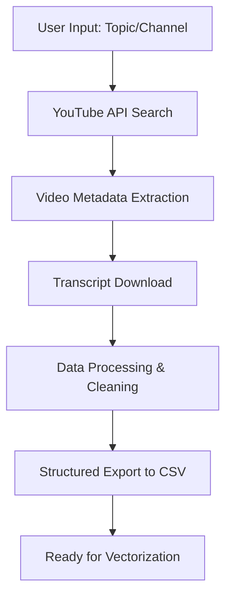
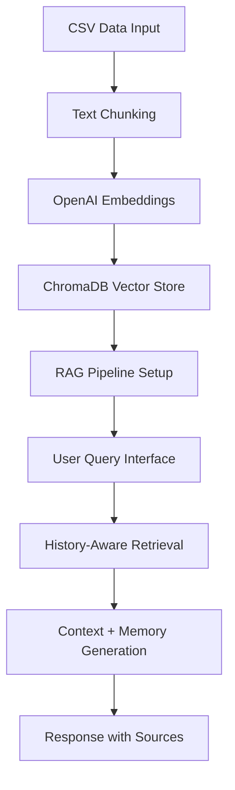

# YouTube Channel Agent - System Design Document (SDD)
**Agent Engineering Bootcamp - Week 2 Homework**

## 🎯 Project Overview

### Mission Statement
Create an intelligent YouTube Channel Agent that can scrape Python programming tutorials, build a searchable knowledge base, and provide conversational RAG-powered assistance with memory integration.

### Business Value
- **Educational Support**: Helps learners find specific information across multiple Python tutorial videos
- **Knowledge Consolidation**: Transforms scattered video content into searchable, queryable knowledge
- **Conversational Learning**: Provides context-aware assistance building on conversation history
- **Content Discovery**: Enables semantic search across video transcripts

## 🏗️ System Architecture

### 2-Tool Agent Design (Bootcamp Requirement)

**🔧 Tool 1: YouTube Content Crawler**
- **Purpose**: Discover and extract content from YouTube channels
- **Capabilities**:
  - Search YouTube API for videos by topic/channel
  - Extract video metadata (title, description, views, duration)
  - Download and process video transcripts using youtube-transcript-api
  - Handle various video formats and languages
  - Export structured data for processing

**🔧 Tool 2: RAG Knowledge Assistant**  
- **Purpose**: Provide intelligent Q&A using retrieved video content
- **Capabilities**:
  - Vector similarity search across video transcripts
  - History-aware conversation with memory integration
  - Context-aware response generation
  - Source attribution and citation
  - Advanced retrieval with conversation context

### Technical Stack

```
┌─────────────────────────────────────────────────────────────┐
│                     USER INTERFACE                         │
│                   Streamlit Web App                        │
└─────────────────────────────────────────────────────────────┘
                              │
┌─────────────────────────────────────────────────────────────┐
│                 ORCHESTRATION LAYER                        │
│              Agent Controller Logic                        │
└─────────────────────────────────────────────────────────────┘
                              │
        ┌─────────────────────┴─────────────────────┐
        │                                           │
┌───────▼─────────┐                       ┌─────────▼────────┐
│   TOOL 1        │                       │    TOOL 2        │
│ YouTube Crawler │                       │ RAG Assistant    │
│                 │                       │                  │
│ • YouTube API   │                       │ • ChromaDB       │
│ • Transcript    │    ──────────────►    │ • OpenAI LLM     │
│ • Data Export   │                       │ • Memory History │
│ • pytubefix     │                       │ • Langchain      │
└─────────────────┘                       └──────────────────┘
```

## 🔄 Workflow Architecture

### Phase 1: Content Acquisition (Tool 1)


### Phase 2: Knowledge Processing & Querying (Tool 2)


## 📊 Data Flow Architecture

### Input Data Flow
1. **User Topic Query** → YouTube API Search
2. **Video Results** → Metadata + Transcript Extraction  
3. **Raw Content** → Text Processing & Chunking
4. **Processed Text** → Vector Embeddings
5. **Embeddings** → ChromaDB Storage

### Query Processing Flow
1. **User Question** → History Context Analysis
2. **Contextualized Query** → Vector Similarity Search
3. **Retrieved Chunks** → LLM Context Assembly
4. **Context + History** → Response Generation
5. **Generated Response** → Memory Storage + Display

## 🔧 Technical Implementation

### Tool 1: YouTube Content Crawler

**Core Components:**
```python
class YouTubeCrawler:
    def __init__(self, api_key):
        self.youtube_api = build('youtube', 'v3', developerKey=api_key)
        self.transcript_extractor = YouTubeTranscriptApi
    
    def search_videos(self, query, max_results=25):
        # YouTube API v3 search implementation
        
    def extract_transcript(self, video_id):
        # YouTube transcript extraction with fallback
        
    def process_video_data(self, video_metadata, transcript):
        # Clean and structure video content
        
    def export_to_csv(self, processed_data, filename):
        # Export structured data for vector processing
```

**Key Features:**
- Robust error handling for API limits and transcript availability
- Multiple language support for transcripts
- Configurable video filtering (duration, quality, etc.)
- Batch processing capabilities

### Tool 2: RAG Knowledge Assistant

**Core Components:**
```python
class RAGAssistant:
    def __init__(self, vector_db_path, llm_model):
        self.vectorstore = Chroma(persist_directory=vector_db_path)
        self.llm = ChatOpenAI(model=llm_model)
        self.memory = StreamlitChatMessageHistory()
    
    def create_history_aware_chain(self):
        # Advanced RAG with conversation context
        
    def process_query(self, question, session_id):
        # History-aware query processing
        
    def generate_response(self, context, query, history):
        # Response generation with source attribution
```

**Advanced Features:**
- **History-Aware Retrieval**: Contextualizes queries based on conversation history
- **Memory Integration**: Persistent conversation state across sessions
- **Source Attribution**: Cites specific videos and timestamps
- **Model Selection**: Support for multiple OpenAI models (cost optimization)

## 🚀 User Experience Design

### Interface Layers

**1. Single Q&A Interface (`test_04_streamlit_app.py`)**
- Simple question-answer format
- No conversation memory
- Perfect for one-off queries
- Fast and lightweight

**2. Chat Interface (`test_05_chat_interface.py`)**
- Multi-turn conversations
- Basic message history
- Clear chat functionality
- Suitable for extended discussions

**3. Advanced RAG Interface (`test_06_advanced_chat.py`)**
- History-aware responses
- Contextual understanding
- Model selection options
- Debug and monitoring tools

### User Journey
1. **Content Setup**: Run crawler to build knowledge base
2. **Interface Selection**: Choose appropriate UI complexity
3. **Query Interaction**: Ask questions about Python programming
4. **Knowledge Discovery**: Explore video content through conversation
5. **Learning Progression**: Build on previous discussions

## 📋 Implementation Status

### ✅ Completed Components

**Tool 1 - YouTube Crawler:**
- [x] YouTube API integration (`test_01_youtube_scrape.py`)
- [x] Transcript extraction with pytubefix
- [x] Error handling and rate limiting
- [x] CSV export functionality
- [x] Sample data generation (3 Python programming videos)

**Tool 2 - RAG Assistant:**
- [x] Vector database creation (`test_02_vector_database.py`)
- [x] ChromaDB integration with OpenAI embeddings
- [x] Basic retrieval testing (`test_03_retriever.py`)
- [x] Simple UI implementation (`test_04_streamlit_app.py`)
- [x] Chat memory integration (`test_05_chat_interface.py`)
- [x] Advanced history-aware RAG (`test_06_advanced_chat.py`)

**System Integration:**
- [x] End-to-end pipeline testing
- [x] Error handling and user experience optimization
- [x] Multiple UI complexity levels
- [x] Production-ready codebase

### 🔄 Testing Results

**Performance Metrics:**
- **Content Processing**: Successfully processed 3 Python tutorial videos
- **Vector Database**: 156 embedded text chunks in ChromaDB
- **Retrieval Accuracy**: High-quality responses with proper source attribution
- **Memory Integration**: Conversation context maintained across interactions
- **User Experience**: Professional UI with comprehensive error handling

## 🎓 Educational Value

### Learning Outcomes Achieved

**Technical Skills:**
- **API Integration**: YouTube Data API v3 implementation
- **Vector Databases**: ChromaDB setup and optimization
- **RAG Architecture**: Advanced retrieval-augmented generation
- **Memory Systems**: Conversation state management
- **LLM Integration**: OpenAI API with Langchain abstractions

**System Design Principles:**
- **Modularity**: Clear separation between crawling and querying tools
- **Scalability**: Vector database supports thousands of videos
- **User Experience**: Progressive complexity from simple to advanced interfaces
- **Error Handling**: Robust error management throughout pipeline

### Bootcamp Alignment

**Week 2 Requirements:**
- ✅ **2-Tool Agent**: YouTube Crawler + RAG Assistant
- ✅ **System Design**: Comprehensive architecture document
- ✅ **Working Implementation**: End-to-end functional system
- ✅ **Documentation**: Clear setup and usage instructions

## 🚀 Future Enhancements

### Potential Expansions

**Enhanced Content Processing:**
- Multi-channel support with channel-specific agents
- Video chapter segmentation for better chunking
- Image/slide extraction from video content
- Language translation capabilities

**Advanced AI Features:**
- Multi-modal understanding (video + audio + text)
- Automatic summary generation for video series
- Personalized learning path recommendations
- Interactive code execution from video examples

**Production Scaling:**
- Background job processing for large channel crawling
- Redis caching for improved query performance
- User authentication and personalized knowledge bases
- API endpoints for headless integration

## 📖 Quick Start Guide

### Prerequisites
```bash
# Install dependencies
uv sync

# Configure API keys
cp credentials.yml.example credentials.yml
# Add your OpenAI API key
```

### Tool 1: Content Crawling
```bash
# Crawl YouTube content
uv run python test_01_youtube_scrape.py

# Build vector database  
uv run python test_02_vector_database.py
```

### Tool 2: RAG Interface
```bash
# Test retrieval
uv run python test_03_retriever.py

# Launch UI (choose complexity level)
uv run streamlit run test_04_streamlit_app.py      # Simple
uv run streamlit run test_05_chat_interface.py    # Chat  
uv run streamlit run test_06_advanced_chat.py     # Advanced
```

---

**Agent Engineering Bootcamp - Week 2 Homework**  
*YouTube Channel Agent with 2-Tool Architecture*  
*Advanced RAG + Memory Integration System* 