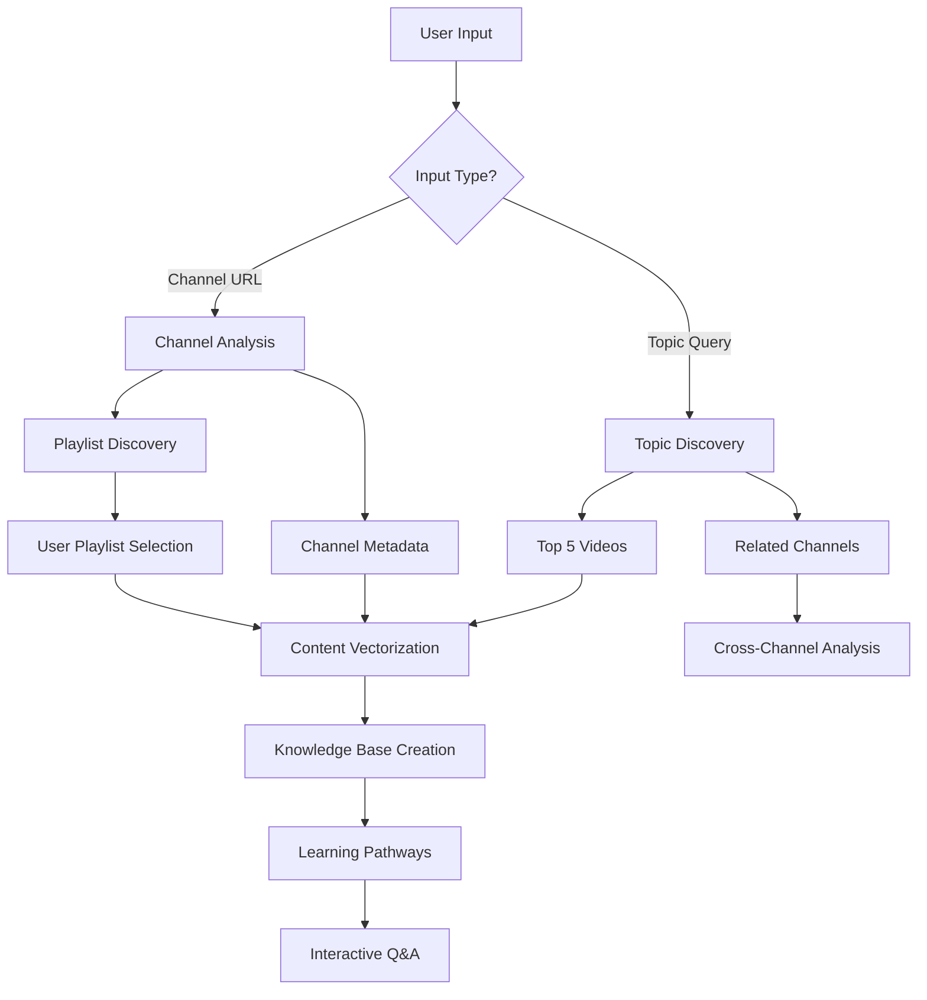

# 🚀 Enhanced YouTube Learning Platform - Strategic Analysis
**Building on Agent Engineering Bootcamp Foundation**

## 🎯 Vision Analysis: From Agent to Learning Ecosystem

### Current Foundation ✅
- **2-Tool Agent**: YouTube Crawler + RAG Assistant
- **Single Database**: 3 Python programming videos
- **Basic Q&A**: Simple retrieval with memory

### Enhanced Vision 🚀
- **Multi-Database Management**: Create/switch between topic-specific knowledge bases
- **Channel Intelligence**: Full channel analysis with playlist discovery
- **Learning Pathways**: Structured educational progression
- **Content Discovery**: Related channels and topic mapping

---

## 🏗️ Enhanced Architecture Design

### **Core User Journey**


### **Enhanced Tool Architecture**

**🔧 Tool 1: Intelligent Content Discovery**
- **Channel Analysis**: Full channel metadata, subscriber count, video statistics
- **Playlist Detection**: Automatically discover and categorize playlists
- **Topic Mapping**: Semantic analysis of channel content themes
- **Related Channel Discovery**: Find similar educational channels
- **Content Filtering**: Quality metrics (views, engagement, recency)

**🔧 Tool 2: Multi-Database RAG System**
- **Database Management**: Create, switch, merge knowledge bases
- **Cross-Database Queries**: Search across multiple topic areas
- **Learning Path Generation**: Structured progression through content
- **Summary & Outline Creation**: Automatic content organization
- **Progress Tracking**: User learning journey analytics

---

## 📊 Feature Analysis & Recommendations

### 🎯 **1. Database Management Strategy**

**Your Idea**: "User can interact with existing db or create new one"

**Strategic Input**:
```python
# Enhanced Database Architecture
class DatabaseManager:
    def __init__(self):
        self.databases = {
            "breakintodata": "data/channels/breakintodata_db/",
            "python_basics": "data/topics/python_basics_db/",
            "data_science": "data/topics/data_science_db/"
        }
    
    def create_database(self, name, source_type, source_url):
        # Create new topic/channel-specific database
        
    def list_databases(self):
        # Show available knowledge bases with metadata
        
    def switch_database(self, db_name):
        # Change active knowledge base for queries
```

**Recommendations**:
- ✅ **Database Naming Convention**: `channel_<channelname>` vs `topic_<topicname>`
- ✅ **Metadata Storage**: Store creation date, video count, last updated
- ✅ **Database Merging**: Allow combining related databases
- ✅ **Size Management**: Implement database pruning for large channels

### 🎯 **2. Channel Analysis Enhancement**

**Your Idea**: "@BreakIntoData channel analysis with playlist discovery"

**Strategic Input**:
```python
class ChannelAnalyzer:
    def analyze_channel(self, channel_url):
        return {
            "channel_info": self.get_channel_metadata(),
            "playlists": self.discover_playlists(),
            "topic_themes": self.extract_content_themes(),
            "video_statistics": self.analyze_video_performance(),
            "related_channels": self.find_similar_channels()
        }
    
    def discover_playlists(self):
        # Return structured playlist data with descriptions
        
    def find_similar_channels(self, limit=5):
        # Use content similarity + YouTube API recommendations
```

**Recommendations**:
- ✅ **Playlist Prioritization**: Show most popular/recent playlists first
- ✅ **Content Categorization**: Auto-classify videos by topic (beginner/intermediate/advanced)
- ✅ **Quality Metrics**: Include engagement rates, view-to-subscriber ratios
- ✅ **Update Tracking**: Monitor for new content and update databases

### 🎯 **3. Topic Discovery Strategy**

**Your Idea**: "Topic search returns top 5 videos + related channels"

**Strategic Input**:
```python
class TopicDiscovery:
    def search_topic(self, topic_query):
        return {
            "top_videos": self.get_top_videos(topic_query, limit=5),
            "related_channels": self.find_topic_channels(topic_query),
            "learning_progression": self.suggest_learning_path(topic_query),
            "topic_clusters": self.identify_subtopics(topic_query)
        }
    
    def get_top_videos(self, topic, limit=5):
        # Enhanced filtering: recency + quality + educational value
        
    def suggest_learning_path(self, topic):
        # Beginner → Intermediate → Advanced progression
```

**Recommendations**:
- ✅ **Smart Filtering**: Prioritize educational content over entertainment
- ✅ **Recency Balance**: Mix recent content with proven classics
- ✅ **Difficulty Progression**: Organize from beginner to advanced
- ✅ **Cross-Topic Connections**: Show how topics relate to each other

### 🎯 **4. Learning Pathways Innovation**

**Your Idea**: "Provide Summary, Outline, and learning paths"

**Strategic Input**:
```python
class LearningPathGenerator:
    def create_learning_path(self, topic, user_level="beginner"):
        return {
            "pathway_overview": self.generate_overview(topic),
            "structured_outline": self.create_outline(topic),
            "prerequisite_topics": self.identify_prerequisites(topic),
            "progression_steps": self.design_progression(topic, user_level),
            "practice_suggestions": self.suggest_exercises(topic)
        }
    
    def generate_overview(self, topic):
        # AI-generated summary of the learning domain
        
    def create_outline(self, topic):
        # Hierarchical content organization
```

**Recommendations**:
- ✅ **Adaptive Pathways**: Adjust based on user progress and preferences
- ✅ **Cross-References**: Link related concepts across videos
- ✅ **Practical Applications**: Include real-world project suggestions
- ✅ **Assessment Integration**: Quiz questions based on video content

---

## 🔧 Implementation Strategy

### **Phase 1: Enhanced Foundation** (Immediate)
1. **Multi-Database Support**: Extend current system to handle multiple knowledge bases
2. **Channel Analysis**: Implement @BreakIntoData as pilot channel
3. **UI Enhancement**: Add database selection and creation interface

### **Phase 2: Content Intelligence** (Short-term)
1. **Playlist Discovery**: Full channel playlist analysis
2. **Related Channel Detection**: Content similarity algorithms
3. **Topic Clustering**: Automatic content categorization

### **Phase 3: Learning Ecosystem** (Medium-term)
1. **Learning Path Generation**: AI-powered educational progression
2. **Cross-Database Queries**: Search across multiple knowledge bases
3. **Progress Tracking**: User learning journey analytics

### **Phase 4: Advanced Features** (Long-term)
1. **Collaborative Learning**: Multi-user knowledge sharing
2. **Content Curation**: Community-driven quality ratings
3. **Integration APIs**: Connect with other learning platforms

---

## 💡 Strategic Recommendations

### 🎯 **1. Start with @BreakIntoData Pilot**
- **Why**: Established data science channel with structured content
- **Benefit**: Clear learning progressions and high-quality educational material
- **Implementation**: Create comprehensive database covering all playlists

### 🎯 **2. Implement Smart Playlist Selection**
```python
# Enhanced Playlist UI
def display_playlist_options(playlists):
    for playlist in playlists:
        st.write(f"📚 {playlist.title}")
        st.write(f"📊 {playlist.video_count} videos | {playlist.total_duration}")
        st.write(f"🎯 Topics: {', '.join(playlist.topics)}")
        st.write(f"📈 Difficulty: {playlist.difficulty_level}")
```

### 🎯 **3. Cross-Channel Intelligence**
- **Content Similarity**: Use embeddings to find related channels
- **Quality Metrics**: Prioritize channels with high educational value
- **Complementary Content**: Suggest channels that fill knowledge gaps

### 🎯 **4. User Experience Optimization**
```python
# Enhanced UI Flow
class EnhancedUI:
    def main_interface(self):
        st.sidebar.selectbox("Select Knowledge Base", self.list_databases())
        
        tab1, tab2, tab3 = st.tabs(["Create New DB", "Explore Content", "Learning Paths"])
        
        with tab1:
            self.database_creation_interface()
        with tab2:
            self.content_exploration_interface()
        with tab3:
            self.learning_path_interface()
```

---

## 🚀 Next Steps Discussion

### **Immediate Priorities**:
1. **Which feature excites you most?** (Database management, channel analysis, learning paths?)
2. **@BreakIntoData implementation?** Should we start with their most popular playlist?
3. **UI complexity?** Keep simple for now or build the full multi-tab interface?
4. **Database strategy?** One database per channel or flexible topic-based grouping?

### **Technical Considerations**:
- **YouTube API Limits**: How to handle rate limiting for large channels?
- **Storage Strategy**: Local ChromaDB vs cloud-based vector stores?
- **Performance**: Caching strategies for large knowledge bases?
- **User Management**: Single user vs multi-user system?

---

## 🎯 **Your Vision Assessment: EXCELLENT** ✅

**Strengths of Your Approach**:
- ✅ **User-Centric**: Flexible database creation based on user needs
- ✅ **Comprehensive**: Covers discovery, analysis, and learning
- ✅ **Scalable**: Can grow from single topics to entire educational ecosystems
- ✅ **Practical**: Addresses real learning challenges with structured pathways

**This transforms our bootcamp project into a genuine EdTech platform!** 🎓

What aspect would you like to dive deeper into first? 